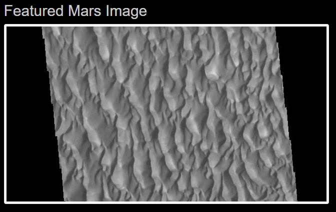

# Purpose
This exercise combines webscraping, flask, pymongo, and html bootstraping to create a web application. 
# Scraping
The scraping uses Python's beautiful soup to parse web pages into HTML text. This text is then filtered / searched to find the relevant informatoin
# Bootstrap Formatting
The base style used to build the webpage is bootstrap. This creates a grid system to overlay and place the web components into.

## Bootstrap Changes
The only two "official" bootstrap changes were made to the website.

1. The button in the Jumbotro header was chagned to green.
2. The images were changed to thumbnails.

All other changes such as background colors and text colors were made using the html style command. Colors are a hard coded in bootstrap and style is needed to overwrite the default bootstrap values.